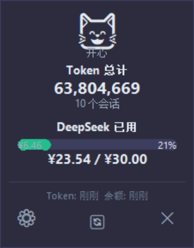

# TokenPet

一个 Windows 桌面宠物，实时监控 Codex 的 Token 消耗和 DeepSeek 账户余额。




---

## 功能

- 实时显示 Codex 所有会话的 Token 累计用量
- 实时显示 DeepSeek 账户余额（CNY）
- 带情绪反馈的桌面宠物窗口（😸 开心 / 😺 平静 / 😿 焦虑 / 🙀 危险）
- 支持拖拽移动、右键菜单、窗口透明度调节
- 完整设置面板（API Key、更新频率、余额上限、窗口透明度、开机自启）
- 支持开机自启

---

## 前置条件

- **操作系统：** Windows 10/11
- **Python：** 3.11 或更高
- **Codex** 桌面端（需要已经使用过，确保本地数据库存在）
- **DeepSeek API Key**（可选，不配置则不显示余额）

---

## 安装

```bash
git clone https://github.com/你的用户名/token-pet.git
cd token-pet
pip install -r requirements.txt
copy .env.example .env
# 然后编辑 .env 填入 DeepSeek API Key
python main.pyw
```

也可双击 main.pyw 运行，或使用 TokenPet.lnk 快捷方式。

---

## 配置

编辑 `.env` 文件：

```env
DEEPSEEK_API_KEY=sk-your-key-here
POLL_INTERVAL_MS=2000
BALANCE_INTERVAL_MS=300000
BALANCE_LIMIT=20.0
ALPHA=0.92
```

或右键桌宠 → 设置，在界面中直接修改，保存后自动写回 `.env`。

---

## 项目结构

```
token-pet/
├── main.pyw              # 入口
├── pet/
│   ├── app.py          # 桌宠窗口主逻辑
│   ├── renderer.py     # 绘制函数
│   ├── collector.py    # Codex 数据采集
│   ├── balance.py      # DeepSeek API
│   ├── state.py        # 状态聚合 + 情绪计算
│   └── config.py       # 配置管理
├── requirements.txt       # 依赖
├── .env.example            # 配置模板
├── TokenPet.lnk            # Windows 快捷方式
└── LICENSE                 # MIT
```

---

## 技术栈

GUI: tkinter (Python 内置)
数据库: SQLite (Python 内置)
HTTP: urllib (Python 内置)
配置: python-dotenv
包装: PyInstaller (optional)

---

## 许可证

[MIT](LICENSE)
